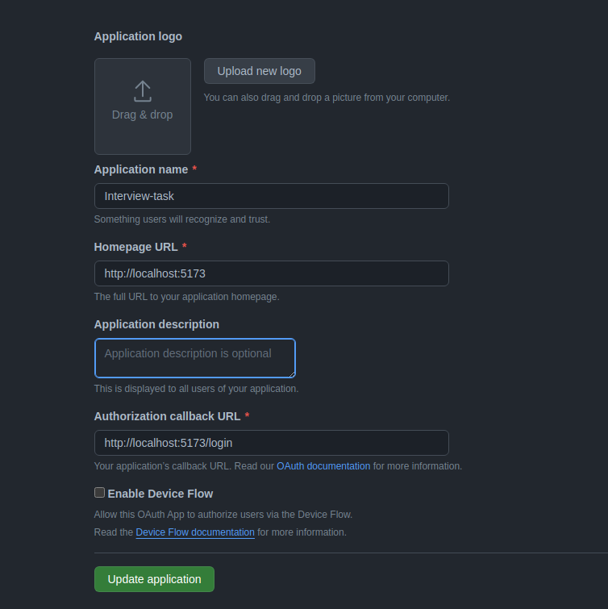

# Frontend App Readme

## Description

This frontend application complements the backend, providing a user interface for interacting with the proxy server that saves starred repositories and collects commit counts periodically.

## Pre-requisites

Creating an oauth app: <https://docs.github.com/en/apps/oauth-apps/building-oauth-apps/creating-an-oauth-app>
Docker and docker compose
NVM <https://github.com/nvm-sh/nvm> or Node v20.11.1

Run nvm install to use the node version

Configuring the oauth app:


## Setup

To run the frontend project, follow these instructions:

1. Duplicate the `.env` file to create a new `.env.development` file. Add the client id generated from the oauth app

    ```bash
    cp .env .env.development
    ```

   Fill in the necessary values in the new `.env.development` file.

2. Install vite ("vite": "^5.1.4",)

    ```bash
    nvm use
    npm install vite
    ```

3. Build and run the application using Docker Compose.

    ```bash
    docker-compose up -d --build
    ```

This sets up the environment, builds the Docker containers, and starts the frontend application.

## Docker Compose

The provided `docker-compose.yml` file sets up the necessary containers for the frontend application. The `-d` flag runs the containers in the background.
